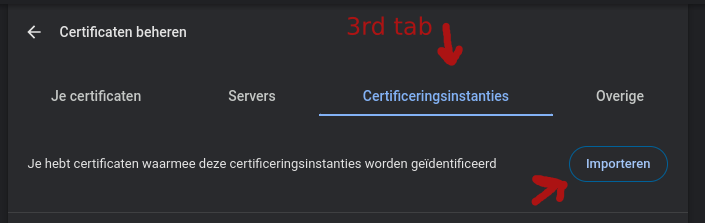
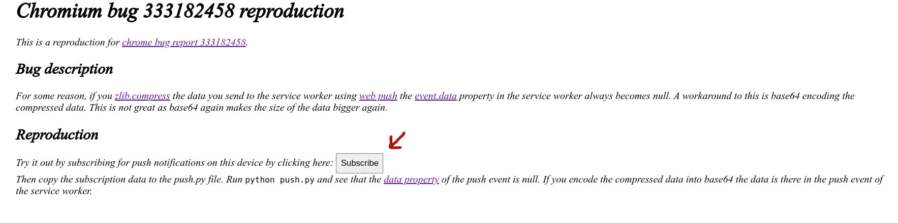
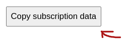

This repo is a reproduction for [Chromium bug 333182458](https://issues.chromium.org/u/1/issues/333182458).

# Reproduction steps 

0. Create a python virtual environment `python -m venv venv`
1. Start the virtual environment `. venv/bin/activate` or `source venv/bin/activate`
2. Install the python dependencies with `pip install -r requirements.txt` 
3. Add the CA.pem to chrome ([chrome://settings/certificates](chrome://settings/certificates)) to get a valid https server.
Make sure to import CA.pem as a certificate authority and not as a certificate. It is the 3rd tab.

 

4. Start the webserver with `python https_server.py` the pass phrase is `test`
5. Open [https://localhost:8000](https://localhost:8000)
6. Click the `Subscribe` button

7. Give permissions for push notifications if promted
8. Copy the subscription data by pressing the button
 

9. Paste the subscription data into the [push.py](push.py) file (line 9). Replace the `...`
10. Run `python push.py` 
11. Observe that the [data property](https://developer.mozilla.org/en-US/docs/Web/API/PushEvent/data) of the push event in the service worker is null. 
It should say `Received 64 bytes in push event` instead you get `Data is null!`.

12. Uncomment line 21 in [push.py](push.py) to enable base64 encoding. 
13. Run `python push.py` again, now the data is received properly.

> Do not forget to remove the certificate authority again in step 1.

# What should actually happen

On firefox the data is always there as it should be. 
Both with and without the base64 encoding. So in Firefox you get:

- `Received 64 bytes in push event` without base64 encoding.
- `Received 90 bytes in push event` with base64 encoding.

This is the correct behavior. On Chromium you get `Data is null!!` if you do not base64 encode the data. This is not correct.

When trying this on firefox you can skip step 3, you can just click `Accept the risk` instead.

